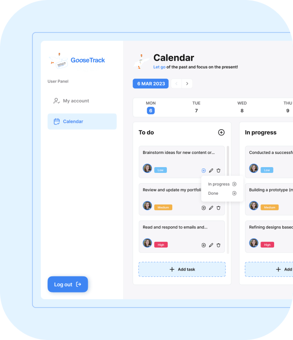

  

<h1 align="center">Welcome to GooseTracks</h1>

  

<h2 align="center">Calendar Month View</h2>

  Discover GooseTracks' Calendar view, your key to gaining a comprehensive perspective of your schedule. It gracefully showcases your tasks, events, and appointments, ensuring you remain seamlessly aligned with your daily, weekly, or monthly obligations.

  

<h2 align="center">Calendar Day View</h2>

   GooseTracks stands as the ultimate all-in-one productivity solution, meticulously crafted to streamline and simplify your daily life. Bid farewell to scattered to-do lists, and welcome a seamlessly productive journey with GooseTracks. It enables you to efficiently manage tasks, events, and deadlines from a single unified platform, ensuring that you stay organized and consistently on top of all your commitments.

  

<h2 align="center">Sidebar</h2>

  GooseTracks streamlines the accessibility of your account settings, calendar, and filters via the Sidebar. Within the "My Account" section, you have the flexibility to customize your profile and preferences, shaping your GooseTracks experience to suit your unique needs. Simultaneously, the Sidebar's calendar provides a swift and convenient means to preview forthcoming events and tasks.

  

<h2 align="center">Reviews</h2>

  Your feedback is of immense importance to us! We kindly request you to spare a moment and share your thoughts and experiences with GooseTracks. Your reviews serve as a cornerstone in our continuous journey of improvement, guaranteeing that we deliver exceptional service to our esteemed users.

  We extend our heartfelt gratitude for choosing <strong>GooseTracks</strong>. We firmly believe it will turbocharge your productivity and streamline your schedule with utmost efficiency.

# Dependencies

  This project relies on various dependencies to enhance its functionality and user experience. Below is a list of key dependencies and their versions:

- **@emotion/react (^11.11.1)** and **@emotion/styled (^11.11.0)**: The Emotion library for handling CSS styling in React applications.
- **@mui/icons-material (^5.14.13)** and **@mui/material (^5.14.13)**: Material-UI, a design library that provides a rich set of pre-built components and styles in the Material Design tradition.
- **@mui/styled-engine-sc (^6.0.0-alpha.1)**: The styled engine for Material-UI, enhancing styling capabilities.
- **@reduxjs/toolkit (^1.9.7)**: Redux Toolkit, which simplifies state management in React applications.
- **@vitejs/plugin-react-swc (^3.4.0)**: A Vite plugin for optimizing React code.
- **axios (^1.5.1)**: A library for making HTTP requests and handling data interactions with servers.
- **date-fns (^2.30.0)**: A library for handling date and time-related operations.
- **formik (^2.4.5)**: A library for simplifying form management in React applications.
- **moment (^2.29.4)**: A library for handling and formatting dates and times.
- **normalize.css (^8.0.1)**: A CSS file that normalizes styles across different browsers.
- **notiflix (^3.2.6)**: A library for displaying notifications in your application.
- **npm (^10.2.0)**: Node Package Manager for installing and managing project dependencies.
- **react (^18.2.0)** and **react-dom (^18.2.0)**: The core libraries for building React applications.
- **react-datepicker (^4.21.0)**: A library for adding date picker functionality to your forms.
- **react-i18next (^13.3.1)**: A library for enabling internationalization (i18n) and translations in your app.
- **react-icons (^4.11.0)**: A library providing a collection of icons for React applications.
- **react-imask (^7.1.3)**: A library for creating input masks in React forms.
- **react-redux (^8.1.3)**: The library for integrating Redux into your React applications.
- **react-router-dom (^6.15.0)**: A library for handling navigation and routing in React applications.
- **react-slick (^0.29.0)**: A library for creating responsive carousel components.
- **react-spinners (^0.13.8)**: A library for adding loading spinners and animations to your application.
- **react-toastify (^9.1.3)**: A library for displaying toast notifications in your app.
- **recharts (^2.9.0)**: A library for creating interactive charts and diagrams in React.
- **redux (^4.2.1)**: The library for managing application state.
- **redux-persist (^6.0.0)**: A library for persisting and rehydrating your Redux store.
- **slick-carousel (^1.8.1)**: A library for creating carousel components with slick animations.
- **styled-components (^6.1.0)**: A library for styling React components with tagged template literals.
- **vite-plugin-svgr (^3.2.0)**: A Vite plugin for handling SVG files as React components.
- **yup (^1.3.2)**: A library for data validation and form schema definition in React applications.

These dependencies enable the project to provide a wide range of features and enhance the user experience. Be sure to keep them up to date for optimal performance and security.

# Our Development Team

Here are the talented individuals who have contributed to the development of GooseTracks:

## Teamleaders 

1. [Maksym Stepanenko](https://github.com/MaksymStepanenko)
2. [Igor Grybanov](https://github.com/IngvarVG76)

## Scrum Master 

3. [Yuliia Yehorova](https://github.com/YYuliia1102)

## Backend developers

3. [Yuliia Yehorova](https://github.com/YYuliia1102)
4. [Yaroslav Zamrii](https://github.com/YaroslavZamrii)

## Frontend developers

5. [Julia Tarasenko](https://github.com/JuliaTarasenko00)
6. [Iryna Artymuk](https://github.com/Iryna-Artymuk)
7. [Volodymyr Pliuto](https://github.com/VovaPliuto)
8. [Oleg Podlesny](https://github.com/SpaceProdigy)
9. [Sergey Kravchenko](https://github.com/Serzh1006)
10. [Yurii Ilkevych](https://github.com/Yurii-Ilkevych)
11. [Oleksandr Martyniuk](https://github.com/Derovse)
12. [Egor Krechuniak](https://github.com/Egor4ik2)

